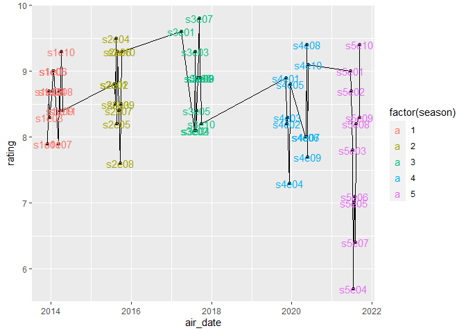

## Best Rick And Morty Season

| season|   rating|
|------:|--------:|
|      3| 8.820000|
|      2| 8.690000|
|      1| 8.572727|
|      4| 8.370000|
|      5| 7.760000|

Using the mean IMDB score of every episode we conclude that best season is 3 and the lowest ranked season is the fifth.

# Top 10 episodes

|name                                 | season| rating|
|:------------------------------------|------:|------:|
|The Ricklantis Mixup                 |      3|    9.8|
|The Rickshank Rickdemption           |      3|    9.6|
|Total Rickall                        |      2|    9.5|
|The Vat of Acid Episode              |      4|    9.4|
|Rickmurai Jack                       |      5|    9.4|
|Close Rick-counters of the Rick Kind |      1|    9.3|
|The Ricks Must Be Crazy              |      2|    9.3|
|The Wedding Squanchers               |      2|    9.3|
|Pickle Rick                          |      3|    9.3|
|Star Mort Rickturn of the Jerri      |      4|    9.1|

# Worst 10 episodes

|name                                        | season| rating|
|:-------------------------------------------|------:|------:|
|Rickdependence Spray                        |      5|    5.7|
|Gotron Jerrysis Rickvangelion               |      5|    6.4|
|Amortycan Grickfitti                        |      5|    7.0|
|Rick & Morty's Thanksploitation Spectacular |      5|    7.1|
|Claw and Hoarder: Special Ricktim's Morty   |      4|    7.3|
|Interdimensional Cable 2: Tempting Fate     |      2|    7.6|
|Childrick of Mort                           |      4|    7.7|
|A Rickconvenient Mort                       |      5|    7.8|
|Pilot                                       |      1|    7.9|
|Raising Gazorpazorp                         |      1|    7.9|

# Best director

|directed_by      | mean_imdb| count|        sd|
|:----------------|---------:|-----:|---------:|
|Dominic Polcino  |  8.900000|     5| 0.6670832|
|Stephen Sandoval |  8.900000|     3| 0.4582576|
|Juan Meza-León   |  8.800000|     5| 0.8276473|
|Wes Archer       |  8.766667|     3| 0.5507571|
|Lucas Gray       |  8.700000|     1|        NA|
|Jacob Hair       |  8.533333|     6| 1.1360751|
|Bryan Newton     |  8.487500|     8| 0.3603074|
|John Rice        |  8.466667|     3| 0.2081666|
|Anthony Chun     |  8.425000|     4| 0.8770215|
|Jeff Myers       |  8.300000|     2| 0.5656854|
|Erica Hayes      |  7.980000|     5| 1.3553597|
|Justin Roiland   |  7.900000|     1|        NA|
|Juan Meza-Léon   |  7.800000|     1|        NA|
|Kyounghee Lim    |  7.666667|     3| 0.6506407|
|Douglas Olsen    |  7.100000|     1|        NA|

# Best writers

|writer           | mean_imdb| count|
|:----------------|---------:|-----:|
|Scott Marder     |  9.400000|     1|
|Jessica Gao      |  9.300000|     1|
|Mike McMahan     |  9.033333|     6|
|Dan Guterman     |  8.900000|     4|
|David Phillips   |  8.800000|     1|
|Matt Roller      |  8.800000|     1|
|Albro Lundy      |  8.766667|     3|
|Ryan Ridley      |  8.710000|    10|
|Tom Kauffman     |  8.700000|     6|
|Jeff Loveness    |  8.516667|     6|
|Justin Roiland   |  8.433333|     6|
|Alex Rubens      |  8.400000|     1|
|Dan Harmon       |  8.375000|     4|
|Caitie Delaney   |  8.300000|     1|
|Siobhan Thompson |  8.300000|     1|
|Michael Waldron  |  8.200000|     1|
|James Siciliano  |  8.125000|     4|
|Eric Acosta      |  8.100000|     2|
|Wade Randolph    |  8.100000|     2|
|Erica Rosbe      |  8.100000|     1|
|Jane Becker      |  8.100000|     1|
|Sarah Carbiener  |  8.100000|     1|
|Anne Lane        |  8.050000|     2|
|Rob Schrab       |  7.800000|     1|
|John Harris      |  6.400000|     1|
|Nick Rutherford  |  5.700000|     1|

We observe that some of the top writers did only colaborate in one episode, so we'll filter the data in order to check writers of more than two episodes.

|writer          | mean_imdb| count|
|:---------------|---------:|-----:|
|Mike McMahan    |  9.033333|     6|
|Dan Guterman    |  8.900000|     4|
|Albro Lundy     |  8.766667|     3|
|Ryan Ridley     |  8.710000|    10|
|Tom Kauffman    |  8.700000|     6|
|Jeff Loveness   |  8.516667|     6|
|Justin Roiland  |  8.433333|     6|
|Dan Harmon      |  8.375000|     4|
|James Siciliano |  8.125000|     4|
|Eric Acosta     |  8.100000|     2|
|Wade Randolph   |  8.100000|     2|
|Anne Lane       |  8.050000|     2|

## Rick and Morty IMDB episode scoring over time

<!-- -->

