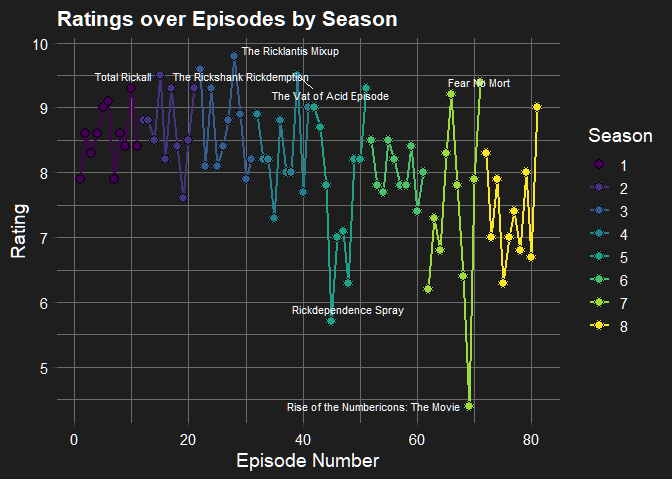

# Seasons


|season | mean_imdb| median_imdb|   sd|
|:------|---------:|-----------:|----:|
|3      |      8.71|        8.60| 0.68|
|2      |      8.69|        8.65| 0.58|
|1      |      8.55|        8.60| 0.45|
|4      |      8.36|        8.20| 0.67|
|6      |      8.01|        7.90| 0.38|
|5      |      7.73|        8.00| 1.18|
|8      |      7.44|        7.20| 0.84|
|7      |      7.37|        7.55| 1.50|

Using the mean IMDB score of every episode we conclude that best season is #3 and the lowest ranked season is the seventh. This season is also the most "volatile", with the highest standard deviation. 


```
## Bin width defaults to 1/30 of the range of the data. Pick better value with
## `binwidth`.
```

<!-- -->

# Episodes

## Top 10 episodes


|name                                 |season | rating|
|:------------------------------------|:------|------:|
|The Ricklantis Mixup                 |3      |    9.8|
|The Rickshank Rickdemption           |3      |    9.6|
|Total Rickall                        |2      |    9.5|
|The Vat of Acid Episode              |4      |    9.5|
|Fear No Mort                         |7      |    9.4|
|Close Rick-counters of the Rick Kind |1      |    9.3|
|The Ricks Must Be Crazy              |2      |    9.3|
|The Wedding Squanchers               |2      |    9.3|
|Pickle Rick                          |3      |    9.3|
|Rickmurai Jack                       |5      |    9.3|

## Worst 10 episodes


|name                               |season | rating|
|:----------------------------------|:------|------:|
|Rise of the Numbericons: The Movie |7      |    4.4|
|Rickdependence Spray               |5      |    5.7|
|How Poopy Got His Poop Back        |7      |    6.2|
|Gotron Jerrysis Rickvangelion      |5      |    6.3|
|The Last Temptation of Jerry       |8      |    6.3|
|Wet Kuat Amortican Summer          |7      |    6.4|
|Morty Daddy                        |8      |    6.7|
|Air Force Wong                     |7      |    6.8|
|Ricker than Fiction                |8      |    6.8|
|Amortycan Grickfitti               |5      |    7.0|
|Valkyrick                          |8      |    7.0|
|Cryo Mort a Rickver                |8      |    7.0|

# Best director


|directed_by         | mean_imdb| count|   sd|
|:-------------------|---------:|-----:|----:|
|Stephen Sandoval    |      8.93|     3| 0.47|
|Dominic Polcino     |      8.90|     5| 0.67|
|Wes Archer          |      8.77|     3| 0.55|
|Juan Meza-León      |      8.60|     5| 0.91|
|Bryan Newton        |      8.46|     8| 0.36|
|Brian Kaufman       |      8.45|     2| 0.78|
|John Rice           |      8.43|     3| 0.15|
|Anthony Chun        |      8.40|     4| 0.86|
|Jeff Myers          |      8.25|     2| 0.49|
|Jacob Hair          |      8.18|    13| 1.04|
|Erica Hayes         |      7.96|     5| 1.34|
|Fill Marc Sagadraca |      7.93|     4| 0.64|
|Justin Roiland      |      7.90|     1|   NA|
|Eugene Huang        |      7.83|     3| 1.40|
|Juan Meza-Léon      |      7.80|     1|   NA|
|Kyounghee Lim       |      7.57|     9| 0.57|
|Douglas Einar Olsen |      7.25|     4| 0.86|
|Douglas Olsen       |      7.10|     1|   NA|
|Lucas Gray          |      7.08|     5| 1.77|

# Best writers


|writer                | mean_imdb| count|
|:---------------------|---------:|-----:|
|Jessica Gao           |      9.30|     1|
|Dan Guterman          |      8.90|     4|
|Mike McMahan          |      8.87|     6|
|David Phillips        |      8.80|     1|
|Matt Roller           |      8.80|     1|
|Ryan Ridley           |      8.70|    10|
|Tom Kauffman          |      8.65|     6|
|Jeff Loveness         |      8.52|     6|
|Albro Lundy           |      8.48|     9|
|Justin Roiland        |      8.43|     6|
|Dan Harmon            |      8.38|     4|
|James Siciliano       |      8.23|    10|
|Caitie Delaney        |      8.20|     1|
|Michael Waldron       |      8.20|     1|
|Siobhan Thompson      |      8.20|     1|
|Eric Acosta           |      8.10|     2|
|Erica Rosbe           |      8.10|     1|
|Jane Becker           |      8.10|     1|
|Sarah Carbiener       |      8.10|     1|
|Wade Randolph         |      8.10|     2|
|Scott Marder          |      8.05|     4|
|Heather Anne Campbell |      7.92|     5|
|Jeremy Gilfor         |      7.90|     1|
|Michael Kellner       |      7.90|     1|
|Jess Lacher           |      7.85|     2|
|Cody Ziglar           |      7.80|     1|
|Anne Lane             |      7.78|     4|
|Alex Rubens           |      7.70|     4|
|Rob Schrab            |      6.88|     4|
|Beth Stelling         |      6.70|     1|
|Nick Rutherford       |      6.68|     4|
|Alex Song-Xia         |      6.40|     1|
|John Harris           |      6.30|     1|

We observe that some of the top writers did only collaborate in one episode, so we'll filter the data in order to check writers of more than two episodes.


|writer                | mean_imdb| count|
|:---------------------|---------:|-----:|
|Dan Guterman          |      8.90|     4|
|Mike McMahan          |      8.87|     6|
|Ryan Ridley           |      8.70|    10|
|Tom Kauffman          |      8.65|     6|
|Jeff Loveness         |      8.52|     6|
|Albro Lundy           |      8.48|     9|
|Justin Roiland        |      8.43|     6|
|Dan Harmon            |      8.38|     4|
|James Siciliano       |      8.23|    10|
|Eric Acosta           |      8.10|     2|
|Wade Randolph         |      8.10|     2|
|Scott Marder          |      8.05|     4|
|Heather Anne Campbell |      7.92|     5|
|Jess Lacher           |      7.85|     2|
|Anne Lane             |      7.78|     4|
|Alex Rubens           |      7.70|     4|
|Rob Schrab            |      6.88|     4|
|Nick Rutherford       |      6.68|     4|

## Rick and Morty IMDB episode scoring over time

<!-- -->


