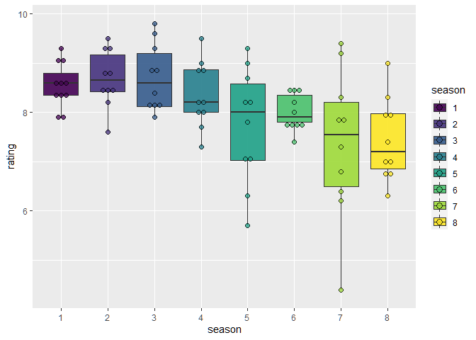

# Seasons

|season | rating|
|:------|------:|
|3      |   8.82|
|2      |   8.69|
|1      |   8.57|
|4      |   8.37|
|6      |   8.16|
|5      |   7.76|

Using the mean IMDB score of every episode we conclude that best season is #3 and the lowest ranked season is the fifth.

<!-- -->

# Episodes

## Top 10 episodes

|name                                 |season | rating|
|:------------------------------------|:------|------:|
|The Ricklantis Mixup                 |3      |    9.8|
|The Rickshank Rickdemption           |3      |    9.6|
|Total Rickall                        |2      |    9.5|
|The Vat of Acid Episode              |4      |    9.4|
|Rickmurai Jack                       |5      |    9.4|
|Close Rick-counters of the Rick Kind |1      |    9.3|
|The Ricks Must Be Crazy              |2      |    9.3|
|The Wedding Squanchers               |2      |    9.3|
|Pickle Rick                          |3      |    9.3|
|Star Mort Rickturn of the Jerri      |4      |    9.1|

## Worst 10 episodes

|name                                        |season | rating|
|:-------------------------------------------|:------|------:|
|Rickdependence Spray                        |5      |    5.7|
|Gotron Jerrysis Rickvangelion               |5      |    6.4|
|Amortycan Grickfitti                        |5      |    7.0|
|Rick & Morty's Thanksploitation Spectacular |5      |    7.1|
|Claw and Hoarder: Special Ricktim's Morty   |4      |    7.3|
|Interdimensional Cable 2: Tempting Fate     |2      |    7.6|
|A Rick in King Mortur's Mort                |6      |    7.6|
|Childrick of Mort                           |4      |    7.7|
|A Rickconvenient Mort                       |5      |    7.8|
|Bethic Twinstinct                           |6      |    7.8|

# Best director

|directed_by         | mean_imdb| count|   sd|
|:-------------------|---------:|-----:|----:|
|Dominic Polcino     |      8.90|     5| 0.67|
|Stephen Sandoval    |      8.90|     3| 0.46|
|Juan Meza-León      |      8.80|     5| 0.83|
|Wes Archer          |      8.77|     3| 0.55|
|Bryan Newton        |      8.49|     8| 0.36|
|Jacob Hair          |      8.47|     9| 0.96|
|John Rice           |      8.47|     3| 0.21|
|Anthony Chun        |      8.43|     4| 0.88|
|Fill Marc Sagadraca |      8.40|     1|   NA|
|Lucas Gray          |      8.35|     2| 0.49|
|Jeff Myers          |      8.30|     2| 0.57|
|Douglas Einar Olsen |      8.05|     2| 0.35|
|Erica Hayes         |      7.98|     5| 1.36|
|Justin Roiland      |      7.90|     1|   NA|
|Kyounghee Lim       |      7.85|     6| 0.46|
|Juan Meza-Léon      |      7.80|     1|   NA|
|Douglas Olsen       |      7.10|     1|   NA|

# Best writers

|writer                | mean_imdb| count|
|:---------------------|---------:|-----:|
|Jessica Gao           |      9.30|     1|
|Mike McMahan          |      9.03|     6|
|Dan Guterman          |      8.90|     4|
|David Phillips        |      8.80|     1|
|Matt Roller           |      8.80|     1|
|Albro Lundy           |      8.78|     4|
|Scott Marder          |      8.75|     2|
|Ryan Ridley           |      8.71|    10|
|Tom Kauffman          |      8.70|     6|
|Jeff Loveness         |      8.52|     6|
|Justin Roiland        |      8.43|     6|
|Dan Harmon            |      8.38|     4|
|Caitie Delaney        |      8.30|     1|
|Heather Anne Campbell |      8.30|     1|
|Siobhan Thompson      |      8.30|     1|
|Michael Waldron       |      8.20|     1|
|Rob Schrab            |      8.20|     2|
|James Siciliano       |      8.18|     5|
|Alex Rubens           |      8.10|     3|
|Eric Acosta           |      8.10|     2|
|Erica Rosbe           |      8.10|     1|
|Jane Becker           |      8.10|     1|
|Sarah Carbiener       |      8.10|     1|
|Wade Randolph         |      8.10|     2|
|Anne Lane             |      7.88|     4|
|Nick Rutherford       |      6.90|     2|
|John Harris           |      6.40|     1|

We observe that some of the top writers did only colaborate in one episode, so we'll filter the data in order to check writers of more than two episodes.

|writer          | mean_imdb| count|
|:---------------|---------:|-----:|
|Mike McMahan    |      9.03|     6|
|Dan Guterman    |      8.90|     4|
|Albro Lundy     |      8.78|     4|
|Scott Marder    |      8.75|     2|
|Ryan Ridley     |      8.71|    10|
|Tom Kauffman    |      8.70|     6|
|Jeff Loveness   |      8.52|     6|
|Justin Roiland  |      8.43|     6|
|Dan Harmon      |      8.38|     4|
|Rob Schrab      |      8.20|     2|
|James Siciliano |      8.18|     5|
|Alex Rubens     |      8.10|     3|
|Eric Acosta     |      8.10|     2|
|Wade Randolph   |      8.10|     2|
|Anne Lane       |      7.88|     4|
|Nick Rutherford |      6.90|     2|

## Rick and Morty IMDB episode scoring over time

<!-- -->

